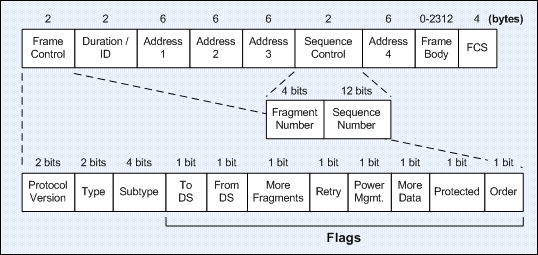

# Airkiss


## About 

[Airkiss][airkiss]是微信提出的一种无线应用层协议,主要用于给无法交互的硬件设备进行网络配置,
如(智能)插座,灯泡,飞机杯等. 其原理是将硬件设备的网卡置于监听模式(monitor mode),
又称为混杂模式(promiscuous mode), 从而获取周围的802.11无线数据帧, 俗称抓包. 
加密的无线数据中length字段是可见的,利用这个字段我们就能约定一种传输数据的协议,
从而在硬件设备初次进入环境时为其提供wifi的帐号密码等信息.
其联网方式类似于TI的[Smart Config][smartcfg].

具体的实现细节可以参考下列**非官方**的资料和文档:

- [Airkss技术实现方案][airkiss_doc]
- [How does TI CC3000 wifi smart config work?][smartcfg_doc]

## Build

`main.c`在Linux下进行切换wifi模式,切换信道以及抓包,实现了一个简单的airkiss上层应用.
编译过程如下:

> Linux下扫描热点需要用到`libiw-dev`.
> 操作网卡如切换信道,切换模式等需要root权限.  

```
$ sudo apt-get install libiw-dev
$ make clean
$ make
```

## Run

运行时需要关闭占用网卡的进程,如NetworkManager等:

```
$ sudo service NetworkManager stop
或者
$ sudo systemctl stop NetworkManager.service
```

运行程序,抓包和切换信道需要root权限:

```
$ sudo ./airkiss wlan1
```

其中wlan1是所选择的无线网卡, 开始运行后可以用微信公众号或者airkiss\_debugger发送wifi密码进行测试

airkiss上层在抓包之前先扫描附近的无线热点并记录其ssid/crc以及信道,从而使得airkiss
只用在这几个信道切换抓包. 另外为了加快Airkiss进度,ssid部分不从data字段读取而只取其crc(用reserved字段记录),
上层应用将记录的ssid/crc进行对比,则可以获取目标的ssid信息并连接.连接后根据airkiss协议,
向10000端口广播random值通知发送端即可完成配置.

> 注:  
> 由于不同抓包策略会导致抓到的包格式各不相同,比如有的是带802.11头的数据帧(亦即微信官方要求的格式),  
> 有的是更底层的比如带Radiotap头的数据,更有的是不带头的纯数据(比如同一局域网内),为了彼此兼容,
> 理论上可以仅用长度来编解码. 但实践中发现,如果不对数据帧进行筛选,周围无线信号过多时会造成很大干扰,
> 从而导致无法在指定时间内完成指定数据的解码, 因此代码里规定数据为802.11数据帧, 并对其24位header进行一定程度的过滤.

802.11的帧结构如下图所示, 目前对Address1/Address2/Address3字段进行了过滤, 其它详细的字段的介绍可以参考[其他博客][80211].



## Known issue

[akdbg]: http://iot.weixin.qq.com/wiki/doc/wifi/AirKissDebugger.apk
[airkiss]:http://iot.weixin.qq.com/wiki/doc/wifi/AirKissDoc.pdf
[smartcfg]:http://processors.wiki.ti.com/index.php/CC3000_Smart_Config
[airkiss_doc]:http://wenku.baidu.com/view/0e825981ad02de80d5d8409c
[airkiss_doc2]:https://www.docdroid.net/UIi8rgt/airkiss-protocol.pdf.html
[smartcfg_doc]:http://electronics.stackexchange.com/questions/61704/how-does-ti-cc3000-wifi-smart-config-work
[80211]:http://www.itcertnotes.com/2011/05/ieee-80211-frame-types.html